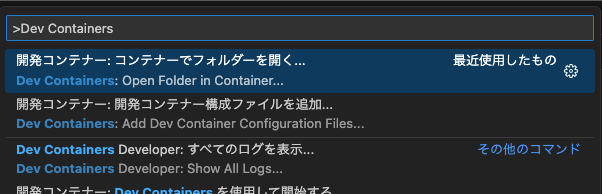

## 概要

pythonやtypescriptを複数人で利用するとき、以下のような問題があった。

- 各自の環境で、コードの整形に統一感がない。
- ビルドに時間がかかる。
- node_modulesがプロジェクトに含まれているため、プロジェクトのサイズが大きくなる。
- しかし、ルートに`node_modules`がないとjavascript/typescriptで`import`、`require`で、正しくモジュールを認識出来ない。

そこで、以下のような構成を考えた。

- Dockerコンテナを利用して、ルートに`node_modules`等の、出来るだけ不要なファイル・ディレクトリを置かないようにする。
- 親のプロジェクト（このディレクトリ）と子プロジェクト（ `./python`、`./web`）に分ける
- nginxで静的ファイルを配信し、APIはpythonで提供する。
- VSCodeのDevContainerを使って、開発環境を構築し、コンテナ内で開発する。
- 厳格なlint / formatterを設定し、コードの品質を保つ。

## 前提とする環境

以下の環境を前提とする。

- Docker
- Docker Compose
- VSCode
  - 機能拡張
    - Remote Container
    - Dev Containers

## 利用方法

1. プロジェクトをクローンする。
2. `docker-compose up -d` を実行してコンテナを作成する。
3. VSCodeで新しいウィンドウを作成し、そのウィンドウに当該プロジェクトを開く。
4. コマンドパレットを開き、`Dev Containers` と入力し、一覧から `開発コンテナー:コンテナでフォルダーを開く...` を選択する。



5. `./python`か、`./web`を選択する。１ウィンドウに１つのコンテナが開くので、両方を開発する場合は、`3.`から繰り返す。

## 構成

```tree
root
├── README.md           # このファイル
├── assets              # README.mdに貼り付ける画像等
├── docker-compose.yaml # コンテナの構成
├── nginx
│   ├── Dockerfile      # nginxのDockerfile
│   ├── configmap.conf  # nginxの設定ファイル（kubernetes用）
│   └── nginx.conf      # nginxの設定ファイル（Docker用）
├── python
│   ├── Dockerfile        # pythonのDockerfile
│   ├── __init__.py
│   ├── main.py           # pythonのメインファイル
│   ├── pyproject.toml    # Python全般やRUFF等の設定ファイル
│   └── requirements.txt  # pythonの依存関係
└── web
    ├── Dockerfile     # WebのDockerfile
    ├── biome.json     # biomeの設定ファイル
    ├── build.js       # node.jsでTypeScriptをビルドするためのファイル
    ├── html
    │   └── index.html # Webのメインファイル
    ├── nodemon.json   # nodemonの設定ファイル
    ├── package.json   # node.jsの設定ファイル
    ├── ts
    │   ├── index.ts   # index.htmlに使用するTypeScriptファイル
    │   └── types.ts   # index.tsで使用するTypeScriptファイル
    └── tsconfig.json  # TypeScriptの設定ファイル
```

## Dev Containers

Dev Contaiersはコンテナ内の環境で作業が出来るVSCodeの強力な機能である。
`./web`と`./python`ディレクトリにそれぞれ設置している`.devcontainer/devcontainer.json`ファイルに設定が書かれている。ファイル内の`extensions`に、Dev Containerとして開いた環境で使いたいVSCodeの機能拡張を定義しておくことも出来る。

## Formatter / Linter

Formatter/Linterは、改行やインデント等を統一し、コードの品質を保つために利用する。

今回は、以下のものを利用する。

- Python
  - [RUFF](https://github.com/astral-sh/ruff) : PythonのFormatter/Linter
- TypeScript
  - [Biome](https://github.com/biomejs/biome) : TypeScriptのFormatter/Linter

## TypeScriptのビルド

TypeScriptは、ブラウザで実行するために、ビルドする必要がある。

今回は、以下の手順でビルドしている。

1. `web`コンテナを起動する。
2. `bash -c "npm run dev"`が実行される。
3. npmの`concurrently`パッケージにより、並列で`nodemon`がコンテナ内で実行される。`nodemon`が実行されると、特定のディレクトリ（`./ts`ディレクトリ）に変更があるか監視し、変更があった場合は、`node build.js`が実行される（`./web/nodemon.json`に記載）。
4. `./web/view` にデータが書き出される。書き出されたデータは、`nginx`コンテナにマウントされている。

#### 補足事項

- コンテナ起動時にも`node build.js`が実行される。
- `./web/view`ディレクトリはビルド時に更新がされる（使用者毎にビルドされる）対象であるので、`.gitignore`で同期の除外対象としている。

### ESBuildについて

ESBuildは速度を重視したビルドツールで、型のチェック等、厳密なビルドを行わず、文法があっていればだいたい出力される。

型チェック等は、Linter / Formatterの領分で、ビルド時には全て正しく記述されていると仮定して運用する。